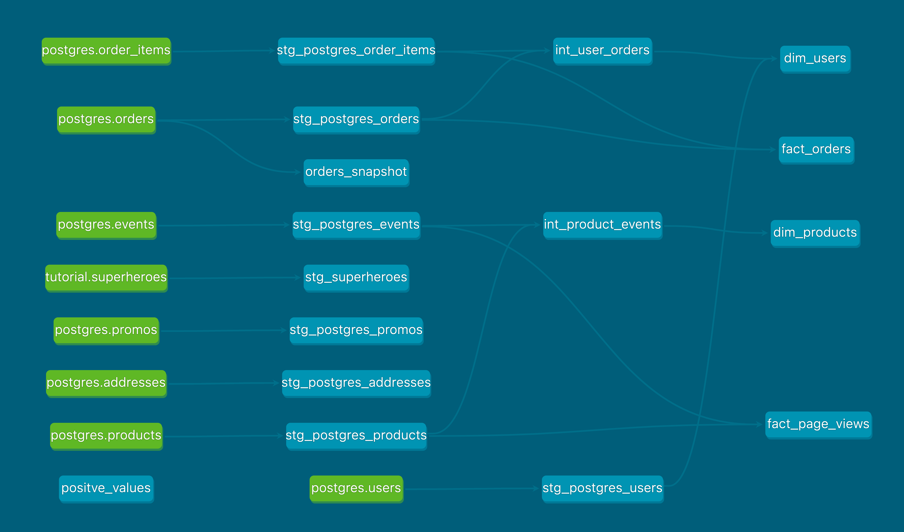

# Week 2 questions

## Part 1: Models
What is our user repeat rate?
```sql
-- Counting orders --
with cte_order_count as (
  select
    user_id,
    count(distinct order_id) as order_count
  from stg_orders
  group by 1
),

-- Identifying returning customers --
cte_multiple_orders as (
  select
    user_id,
    (order_count = 1)::int as one_order,
    (order_count >= 2)::int as multiple_orders
  from cte_order_count
)

-- Calculating repeat rate --
select
  count(distinct user_id) as total_user_count,
  sum(multiple_orders) as returning_customers,
  div0(returning_customers, total_user_count) as repeat_rate
from cte_multiple_orders
```
> Our user repeat rate is 80%.
<br />
What are good indicators of a user who will likely purchase again? What about indicators of users who are likely NOT to purchase again? If you had more data, what features would you want to look into to answer this question?
> The most obvious indicator of purchasing again is if the user is a returning customer already. Other indicators can be if they have visited our site since their last order, maybe even multiple times, if they have an account or even they are logged in. There might be other indicators like they are subscribed to our newsletter or they are following us on social media.<br />
Indicators for not purchasing again might be previous cancelled or returned orders, contacting customer support with a complaint (like "when will I receive my order"), having unsubscribed from our newsletter or have deleted their user account. <br />
In general any data about user events related to them engaging with our business can be a good feature to take a look at, not just order events, but website events, customer support events, newsletter events, etc. <br />

## Part 2: Tests



## Part 3: Snapshots
Which orders changed from week 1 to week 2?

```sql
select 
    * 
from 
    orders_snapshot 
where 
    dbt_valid_to is not null;
``` 
> The following orders have changed: <br /> 265f9aae-561a-4232-a78a-7052466e46b7, <br />
e42ba9a9-986a-4f00-8dd2-5cf8462c74ea,<br />
b4eec587-6bca-4b2a-b3d3-ef2db72c4a4f<br />